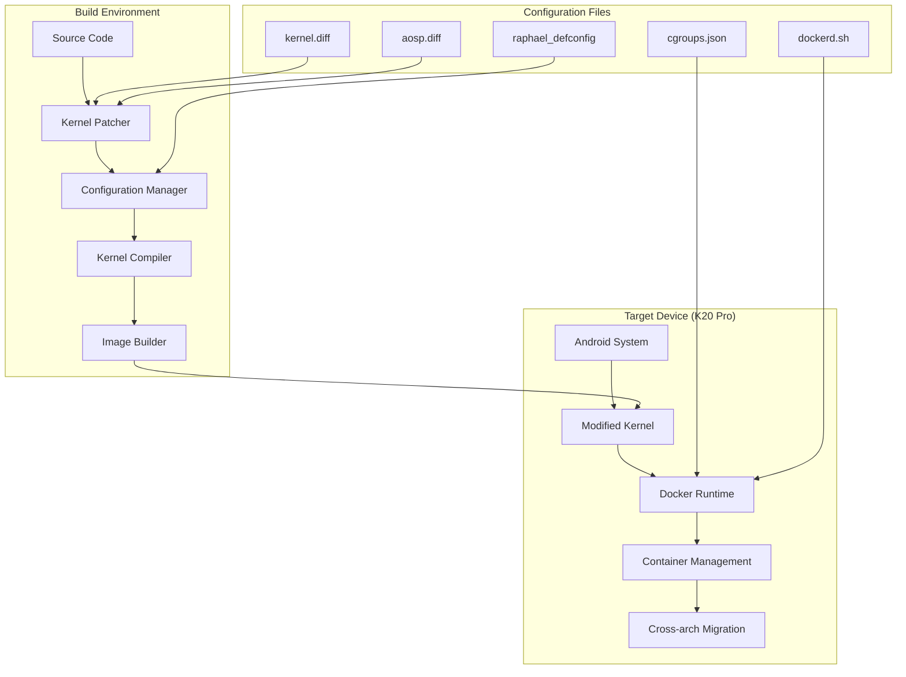

# Design Document

## Overview

The Docker-enabled kernel for K20 Pro is designed as a comprehensive solution that modifies the Android kernel to support Linux container runtime environments. The design leverages the existing Android Container project structure and extends it with automated build processes, proper configuration management, and integration scripts.

The solution consists of four main components:
1. **Kernel Configuration System** - Manages Docker-required kernel options and patches
2. **Build Automation System** - Automates the kernel compilation and integration process  
3. **Runtime Integration System** - Handles Docker daemon startup and Android system integration
4. **Cross-Platform Build Support** - Provides automated setup and verification for Linux and macOS build environments

## Architecture



## Components and Interfaces

### 1. Kernel Configuration Manager

**Purpose:** Manages kernel configuration options required for Docker support

**Key Features:**
- Applies Docker-required kernel configurations from raphael_defconfig
- Validates that all necessary options are enabled
- Provides configuration verification and reporting

**Interface:**
```bash
configure_kernel(base_config, docker_requirements) -> configured_kernel
validate_config(kernel_config) -> validation_report
```

### 2. Kernel Patcher

**Purpose:** Applies necessary patches to kernel source code for Docker compatibility

**Key Features:**
- Applies kernel.diff for Docker-specific modifications
- Modifies cpuset.c to restore cpuset prefixes required by Docker
- Handles memory management patches for container support

**Interface:**
```bash
apply_patches(kernel_source, patch_files) -> patched_source
verify_patches(patched_source) -> patch_status
```

### 3. Build Automation System

**Purpose:** Automates the kernel compilation process with proper toolchain management

**Key Features:**
- Manages cross-compilation toolchain setup
- Handles AOSP integration patches
- Produces bootable kernel images
- Validates build outputs

**Interface:**
```bash
setup_toolchain(target_arch) -> toolchain_config
compile_kernel(source, config, toolchain) -> kernel_image
validate_build(kernel_image) -> build_report
```

### 4. Runtime Integration Manager

**Purpose:** Manages Docker daemon integration with Android system

**Key Features:**
- Configures cgroup subsystems for Docker
- Sets up networking and storage requirements
- Manages SELinux policy adjustments
- Handles Docker daemon lifecycle

**Interface:**
```bash
setup_runtime_environment() -> environment_status
configure_cgroups(cgroup_config) -> cgroup_status
start_docker_daemon(daemon_config) -> daemon_status
```

### 5. Container Migration System

**Purpose:** Enables cross-architecture container migration using CRIU

**Key Features:**
- Checkpoint container state on source architecture
- Transfer container state to target device
- Restore container on ARM64 Android platform
- Validate migration success

**Interface:**
```bash
checkpoint_container(container_id) -> checkpoint_data
transfer_checkpoint(checkpoint_data, target_device) -> transfer_status
restore_container(checkpoint_data) -> restored_container
```

### 6. Cross-Platform Build Support System

**Purpose:** Provides automated setup and verification for different build environments

**Key Features:**
- Automated binutils installation and verification for Linux and macOS
- Cross-compilation toolchain setup and validation
- ELF header detection and configuration
- Build environment health checking and diagnostics

**Interface:**
```bash
setup_build_environment(platform) -> environment_status
verify_binutils_installation() -> verification_report
configure_cross_compilation(target_arch) -> toolchain_config
validate_build_dependencies() -> dependency_status
```

## Data Models

### Kernel Configuration Model
```yaml
KernelConfig:
  base_config: string          # Base defconfig file
  docker_options: list         # Required Docker kernel options
  patches: list                # Kernel patches to apply
  validation_rules: list       # Configuration validation rules
```

### Build Configuration Model
```yaml
BuildConfig:
  source_path: string          # Kernel source directory
  toolchain: ToolchainConfig   # Cross-compilation toolchain
  output_path: string          # Build output directory
  target_device: string        # Target device (raphael)
```

### Runtime Configuration Model
```yaml
RuntimeConfig:
  cgroup_config: string        # Path to cgroups.json
  docker_binaries: list        # Docker binary files
  startup_script: string       # Docker daemon startup script
  selinux_policy: string       # SELinux policy adjustments
```

## Error Handling

### Build-time Error Handling
- **Configuration Errors:** Validate kernel config before compilation
- **Patch Application Errors:** Verify patch compatibility and apply status
- **Compilation Errors:** Provide detailed error reporting with suggested fixes
- **Integration Errors:** Validate AOSP integration and dependency resolution

### Runtime Error Handling
- **Daemon Startup Errors:** Diagnose and report Docker daemon startup issues
- **Cgroup Mount Errors:** Validate and fix cgroup subsystem mounting
- **Network Configuration Errors:** Diagnose and resolve networking issues
- **Container Runtime Errors:** Provide debugging information for container failures

### Migration Error Handling
- **Checkpoint Errors:** Validate container state and dependencies before checkpoint
- **Transfer Errors:** Handle network and storage issues during state transfer
- **Restore Errors:** Diagnose compatibility issues and provide recovery options

## Testing Strategy

### Unit Testing
- **Configuration Validation:** Test kernel config option validation
- **Patch Application:** Test individual patch application and verification
- **Build Process:** Test compilation steps and output validation
- **Runtime Setup:** Test cgroup and networking configuration

### Integration Testing
- **End-to-End Build:** Test complete kernel build process from source to image
- **Docker Integration:** Test Docker daemon startup and basic container operations
- **Android Compatibility:** Test Android system functionality with modified kernel
- **Migration Workflow:** Test complete container migration process

### Device Testing
- **Kernel Boot:** Verify kernel boots successfully on K20 Pro device
- **Docker Functionality:** Test Docker container creation, networking, and storage
- **Performance Testing:** Validate container performance and resource usage
- **Stability Testing:** Long-running tests for system stability and reliability

### Validation Testing
- **Security Testing:** Validate container isolation and security boundaries
- **Compatibility Testing:** Test with various container images and applications
- **Regression Testing:** Ensure Android functionality remains intact
- **Migration Testing:** Validate cross-architecture container migration scenarios